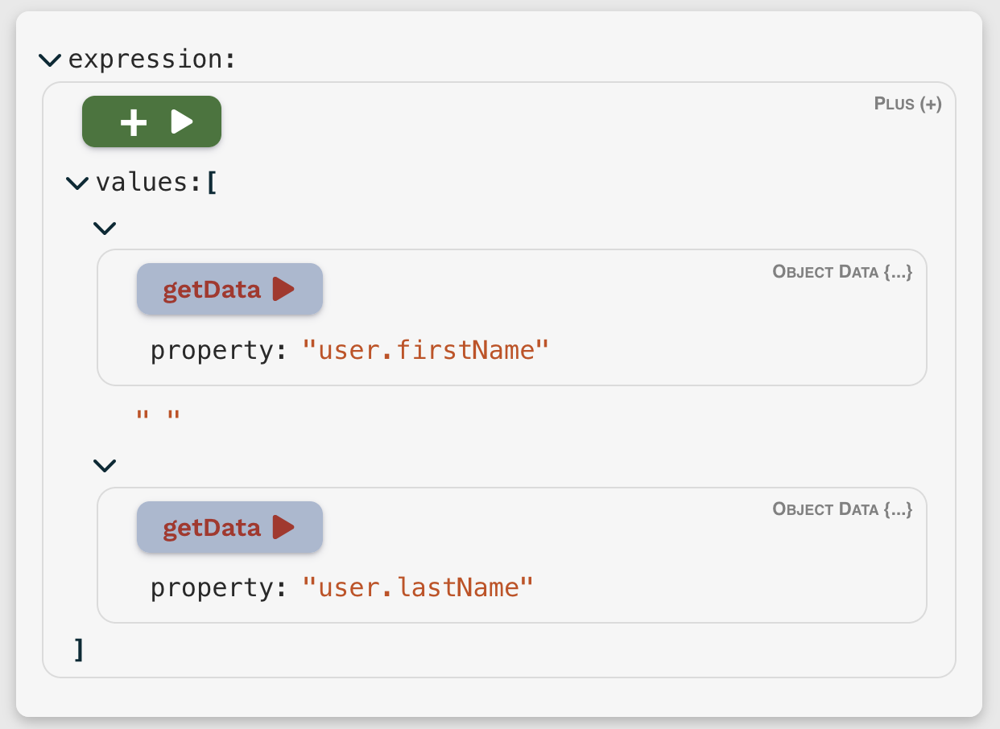

# fig-tree-editor-react

### [Demo/Playground](https://carlosnz.github.io/fig-tree-evaluator/)

A [React](https://github.com/facebook/react) component for constructing and editing [**FigTreeEvaluator**](https://github.com/CarlosNZ/fig-tree-evaluator) expressions.



It's built on [**json-edit-react**](https://carlosnz.github.io/json-edit-react/) (a JSON/object data viewer/editor), so usage is basically the same as for that component. The main addition is the use of [Custom Nodes](https://github.com/CarlosNZ/json-edit-react?tab=readme-ov-file#custom-nodes) to handle the specifics of FigTree expressions, providing validation and custom UI to select and manipulate the various [operators](https://github.com/CarlosNZ/fig-tree-evaluator?tab=readme-ov-file#operator-reference).

Your best bet is to have a play with the [Demo](https://carlosnz.github.io/fig-tree-evaluator/) to get a feel for it.


## Installation

`npm i fig-tree-builder-react`

or 

`yarn add fig-tree-builder-react`

## Implementation

```jsx
import { FigTreeEditor } from 'fig-tree-builder-react'

// In your React component:
return 
  <FigTreeEditor
    // These 3 props are required, the rest are optional
    figTree={figTree} // your FigTree instance
    expression={expressionObject} // your FigTree expression object
    setData={ (data) => updateMyExpression(data) } // function to update your expression object
    { ...otherProps } />
```

## Available props

The majority of props are those for [json-edit-react](https://carlosnz.github.io/json-edit-react/), so won't be covered here. The ones specific to this component are:

### Required

| Prop            | Type                                     | Default | Description                              |
| --------------- | ---------------------------------------- | ------- | ---------------------------------------- |
| `figTree`       | `FigTreeEvaluator`                       |         | A FigTree instance to run evaluations on |
| `expression`    | `EvaluatorNode`</br>(object/array/value) |         | The FigTree expression                   |
| `setExpression` | `(data: EvaluatorNode) => void`          |         | React state update function              |

### Optional

| Prop                           | Type                                            | Default | Description                                                                                                                                                          |
| ------------------------------ | ----------------------------------------------- | ------- | -------------------------------------------------------------------------------------------------------------------------------------------------------------------- |
| `objectData`                   | `object`                                        |         | Data object accessed by FigTree's [`getData`/`objectProperties` operator](https://github.com/CarlosNZ/fig-tree-evaluator?tab=readme-ov-file#object_properties).      |  |
| `onEvaluate`                   | `(value: unknown, e: React.MouseEvent) => void` |         | Optional function to call on the evaluated result after clicking one of the "Evaluate" buttons. Can be used (for example) to display a Notification with the result. |
| `onEvaluateStart`              | `() => void`                                    |         | Called when an "Evaluate" button is clicked. Some evaluations can take some time (e.g. network requests), so this can be used to trigger a "Loading" indicator.      |
| `operatorDisplay`              | `Operator Display Data`                         |         | Used to set the background and text colours for the various Operator "Evaluate" buttons. See [below] for details.                                                    |  |
| `defaultNewOperatorExpression` | `EvaluatorNode`                                 |         | Expression to populate the UI with when switching to a new "Operator" node                                                                                           |  |
| `defaultNewFragment`           | `string`                                        |         | Name of the [Fragment](https://github.com/CarlosNZ/fig-tree-evaluator?#fragments) to default to when switching to new "Fragment" node                                |  |
| `defaultNewCustomOperator`     | `string`                                        |         | Name of the [Custom Operator](https://github.com/CarlosNZ/fig-tree-evaluator?#custom-functionsoperators) to default to when switching to new "Custom Operator" node  |  |


## Operator UI customisation

You can override the colour scheme for each operator in the UI by passing in an object to the `operatorDisplay` prop. Each operator can have the `backgroundColor`, `textColor` and `displayName` defined — see [defaults file](https://github.com/CarlosNZ/fig-tree-editor-react/blob/main/src/operatorDisplay.ts) for specific structure.

You can also specify the colours for [Fragments](https://github.com/CarlosNZ/fig-tree-evaluator?tab=readme-ov-file#fragments) and [Custom Operators](https://github.com/CarlosNZ/fig-tree-evaluator?tab=readme-ov-file#custom-operators) in their [metadata definitions](https://github.com/CarlosNZ/fig-tree-evaluator?tab=readme-ov-file#metadata).

## Help, Feedback, Suggestions

Please open an issue: https://github.com/CarlosNZ/fig-tree-editor-react/issues


## Changelog

- **v0.7.8**:
  - props to set default expression, fragment and custom operator
- **v0.7.5**:
  - Fix possible infinite re-render when loading new expression
- **v0.7.1**:
  - Improve type definitions for styles input
  - Pass "event" to `onEvaluate` function
- **v0.7.0**:
  - Use updated editor package ([json-edit-react](https://carlosnz.github.io/json-edit-react/)) in order to restrict to enum values when appropriate
  - Correct defaults for all operator properties
- **v0.6.6**: Respect editing restrictions in Custom Nodes
- **v0.5.0 – v0.6.5**: Initial release
